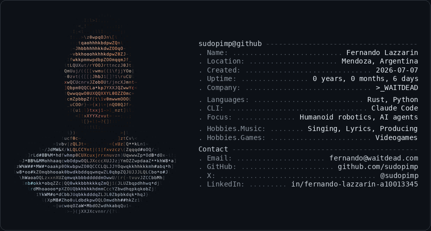

<!-- github profile card — image only -->

  <picture>
    <source media="(prefers-color-scheme: dark)" srcset="./card-dark.png" />
    <source media="(prefers-color-scheme: light)" srcset="./card-light.png" />
    
  </picture>

